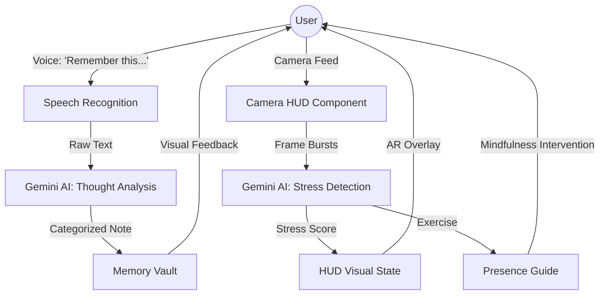

# FocusAR: ADHD Memory Offload

FocusAR is a futuristic Augmented Reality (AR) Heads-Up Display (HUD) designed specifically to support individuals with ADHD. By combining real-time voice capture with AI-driven biometric analysis, FocusAR helps users "offload" distracting thoughts instantly and re-center themselves when sensory or cognitive overload is detected.

## 🧠 The Problem

For individuals with ADHD, a single fleeting thought can derail hours of productivity. The "mental load" of trying to remember a task while staying focused on the current one often leads to:
- **Cognitive Overload**: Too many open "mental tabs."
- **Anxiety Spirals**: Stress from forgetting important details.
- **Interruption Habits**: Sudden jerky movements or loss of focus when a new thought occurs.

## 🚀 The Solution

FocusAR acts as an external "Neural Buffer." It provides a persistent, non-intrusive AR interface that:
1. **Captures Thoughts Instantly**: No need to open an app or pick up a phone. Just speak.
2. **Monitors Well-being**: Uses the camera to detect facial stress markers and restless habits.
3. **Guides Presence**: Intervenes with AI-curated mindfulness exercises when stress levels peak.

---

## 🛠️ Key Features

### 1. Neural HUD Overlay
A high-fidelity AR interface that transforms your workspace into a data-rich environment.
- **Scan Lines & Glitch Effects**: Visual feedback for system status and stress levels.
- **Dynamic Color States**: The HUD shifts from **Sky Blue** (Focused) to **Emergency Red** (High Stress) or **Vibrant Green** (Data Uplink).

### 2. Voice-Activated Memory Offload
Triggered by the phrase *"Remember this thought"*, the system captures your voice and uses **Gemini AI** to:
- **Summarize**: Condense long rambles into actionable notes.
- **Categorize**: Automatically tag thoughts (e.g., #Work, #Personal, #Idea).
- **Prioritize**: Assign urgency levels so you can forget it for now and find it later.

### 3. AI Biometric Stress Detection
The system analyzes camera frames every 15 seconds to monitor:
- **Cognitive Load**: Calculated stress scores based on facial expressions.
- **Interruption Habits**: Detects jerky movements or frequent looking away.
- **Neural Interference**: Real-time alerts when your "Neural Feed" becomes unstable.

### 4. Presence Guide (AI Intervention)
When high stress is detected, FocusAR doesn't just alert you—it helps you.
- **Breathing Anchors**: Visual-guided rhythmic breathing.
- **Grounding Exercises**: 5-4-3-2-1 sensory techniques.
- **Focus Elements**: Minimalist visual anchors to stop "zoning out."

### 5. Memory Vault
A secure, categorized archive of all offloaded thoughts, ensuring nothing is lost while keeping your current mental space clear.

---

## 📊 System Architecture



---

## 💻 Technical Stack

- **Frontend**: React 19, TypeScript, Tailwind CSS.
- **AI Engine**: Google Gemini 3.1 Flash (Multimodal analysis).
- **Animations**: Framer Motion / CSS Keyframes.
- **Voice**: Web Speech API.
- **Vision**: MediaDevices API (Camera burst capture).

---

## 🚦 Getting Started

### Prerequisites
- A modern browser with Camera and Microphone permissions enabled.
- A Gemini API Key (configured in `.env`).

### Installation
1. Clone the repository.
2. Install dependencies:
   ```bash
   npm install
   ```
3. Start the development server:
   ```bash
   npm run dev
   ```

### Usage
- **To Offload**: Say *"Remember this thought"* followed by whatever is on your mind.
- **To Re-center**: If the HUD turns red, follow the on-screen **Presence Guide** instructions.
- **To Review**: Check the **Memory Vault** on the right side of the HUD.

---

## 🛡️ Privacy & Safety
- **Local Processing**: Voice recognition happens in-browser.
- **Transient Frames**: Camera frames are used only for real-time AI analysis and are not stored permanently.
- **User-Centric**: Designed to be a supportive tool, not a distraction.

---
*FocusAR: Stay Present. Offload the Rest.*
